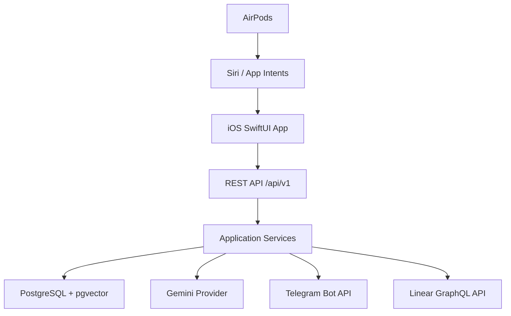

# Architecture

Second Brain is a local-first memory system. It uses Siri and AirPods to capture user intent quickly, stores data locally on iOS with SwiftData, syncs to a Go API when online, and enriches content with AI where available.

## Backend layers

- API: Gin handlers, request validation, response envelopes, auth middleware.
- Application: use-case services for auth, memories, tasks, reminders, search, integrations, and settings.
- Domain: product entities, repository interfaces, provider interfaces, error model.
- Repository: GORM-backed PostgreSQL repositories.
- Infrastructure: Gemini, Telegram, Linear, JWT, bcrypt, OpenTelemetry, Prometheus, zap.

## Local-first guarantees

- iOS capture works offline using `SpeechRecognitionProvider`.
- Basic categorization and tagging have local heuristics.
- AI enrichment is best-effort and never blocks saving.
- SwiftData caches pending captures until sync succeeds.

## Security model

- JWT access tokens with short TTL.
- Refresh token rotation with hashed server-side storage.
- Bcrypt password hashing.
- User-scoped repository queries.
- Integration secrets stored per user and intended for encryption at rest in production.

## Observability

- Structured zap logs.
- Request IDs.
- Prometheus `/metrics`.
- OpenTelemetry SDK bootstrap with optional OTLP exporter endpoint.
